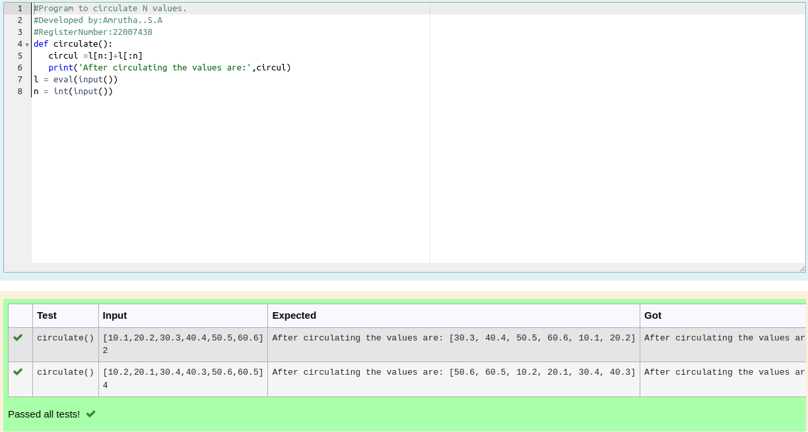

# Circulate-the-values-of-N-variables
## Aim:
To write a python program to circulate the n variables using function concept
## Equipment’s required:
PC
Anaconda - Python 3.7

## Algorithm: 
### Step 1: 
Get the two values from the user
### Step 2:
Assign the value of second variable to a temporary variable
### Step 3: 
Get the value from the user for the number of rotation
### Step 4: 
Using the slicing concept rotate the list
### Step 5: 
Print both the values it would be interchanged
### Step 6:
End the program
## Program:
```python
#Program to circulate N values.
#Developed by:Amrutha..S.A 
#RegisterNumber:22007438
def circulate():
   circul =l[n:]+l[:n]
   print('After circulating the values are:',circul)
l = eval(input())
n = int(input())
```

## Output:


## Result:
